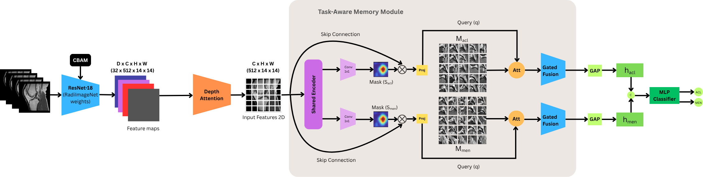
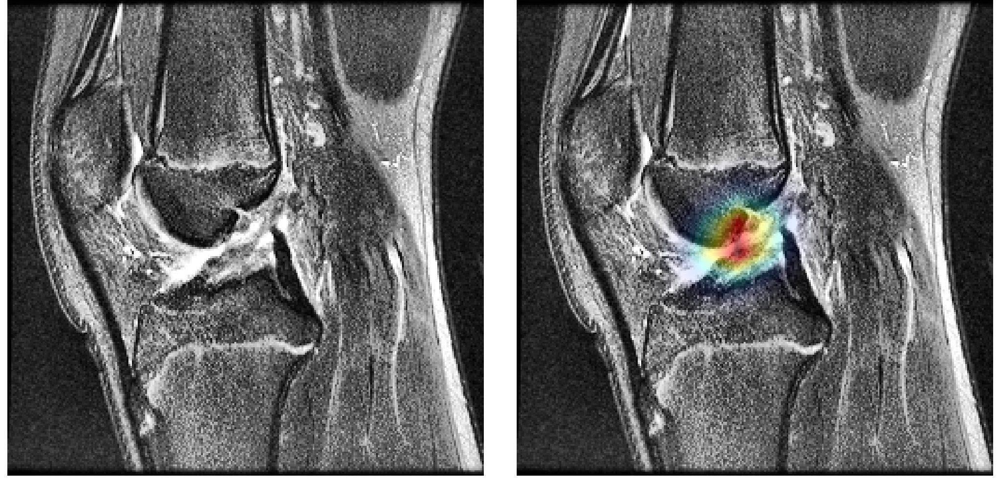
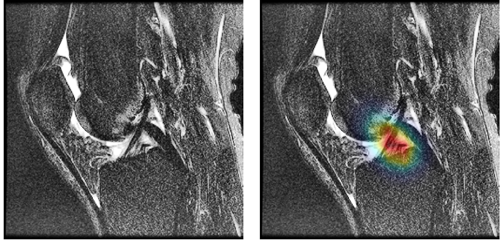

<div align="center">

# 🦵 Knee MRI Multi-Label Classification

### *Bridging 2D Efficiency and 3D Context: A Memory-Guided Framework for Knee MRI Multi-Label Classification*

[](https://www.python.org/)
[](https://pytorch.org/)
[](https://developer.nvidia.com/cuda-toolkit)
[](LICENSE)
[](https://peps.python.org/pep-0008/)

<p align="center">
  <b>Lightweight • Interpretable • Clinically-Inspired</b>
</p>

---

</div>

## 📖 Overview

This repository contains the official implementation of our memory-guided framework for **multi-label knee injury classification** from MRI volumes. Our model jointly detects **ACL tears**, and **Meniscus tears** from a single anatomical view (sagittal, coronal, or axial) while remaining lightweight enough for clinical deployment.

> 🎯 **Key idea.** Instead of relying on expensive 3D CNNs, we combine a **2D ResNet-18 backbone** with **Depth-Aware Attention** and a **Task-Aware Memory Module** that stores pathology-specific prototypes - bridging the efficiency of 2D processing with the volumetric context of 3D understanding.

<div align="center">
  
  <p><i>Figure 1. Overall pipeline architecture.</i></p>
</div>

---

## ✨ Highlights

- 🧠 **Task-Aware Memory.** A learnable key-value memory bank per pathology, queried via Top-K sparse attention, lets the network disentangle co-occurring injuries (e.g. ACL + Meniscus).
- 🔍 **Multi-Scale Center Cropping.** Emulates the radiologist's workflow by feeding global / mid / close-up crops as three channels - capturing both anatomical context and fine-grained lesion texture.
- 📏 **Depth-Aware Attention.** Replaces rigid max-pooling with a learnable per-slice weighting, so the model focuses on the most diagnostic slices instead of averaging signal away.
- 🪶 **Lightweight & Transferable.** Only **~0.65 M trainable parameters** (with RadImageNet pretraining), far smaller than Inception-V4 (41 M) or MVGNN (12.5 M).
- 🔬 **Interpretable.** Grad-CAM++ heatmaps localize anatomical evidence per task, aligning with radiologist annotations.

---

## 📊 Results

### MRNet validation set (single-view sagittal)

| Pathology      |   AUC   |   ACC   |  SENS   |  SPEC   |
| :------------- | :-----: | :-----: | :-----: | :-----: |
| **ACL**        | **0.951** | **0.902** | 0.852 | **0.944** |
| **Meniscus**   | **0.838** | **0.805** | **0.846** | 0.765 |

### Cross-view performance (MRNet) & cross-dataset generalization (KneeMRI)

| Dataset  |       View / Pathology      |  SENS   |  SPEC   |   AUC   |
| :------- | :-------------------------- | :-----: | :-----: | :-----: |
| MRNet    | Axial - ACL                 | 0.9259  | 0.8939  | **0.9604** |
| MRNet    | Axial - Meniscus            | 0.8077  | 0.7647  | 0.8425  |
| MRNet    | Coronal - ACL               | 0.9159  | **0.9537**  | 0.9537  |
| MRNet    | Coronal - Meniscus          | 0.9038  | 0.9091  | 0.8618  |
| KneeMRI  | Sagittal - ACL              | 0.8326  | 0.9219  | **0.9226** |

> 📄 See the [paper](#-citation) for full comparisons against MRNet, ELNet, MVGNN, Inception-V4 and other baselines.

---

## 📦 Pretrained Checkpoints

All pretrained weights are hosted on Google Drive. Download and place them in the project root.

| File                                       | Description                                              | Size   | Link |
| :----------------------------------------- | :------------------------------------------------------- | :----: | :--: |
| `resnet18_modan_mulsupcon_1ch.pth`         | Backbone pretrained with ModAn-MulSupCon on RadImageNet  | ~43 MB | [⬇️ Download](https://drive.google.com/drive/u/0/folders/1xhan_AEau8ze9wMMx3aVxEOphIGLwdMs) |
| `best_model_sagittal_sota_1.pth`           | Best model - Sagittal view                                | ~45 MB | [⬇️ Download](https://drive.google.com/drive/u/0/folders/1zP5A6anAGZOh7hTgtl6mvXRbIUskGBDq) |
| `best_model_coronal_sota_1.pth`            | Best model - Coronal view                                 | ~45 MB | [⬇️ Download](https://drive.google.com/drive/u/0/folders/1qz6SuJYbFpBHSJux5zav7dtCIpOvjVVN) |
| `best_model_axial_sota_1.pth`              | Best model - Axial view                                   | ~45 MB | [⬇️ Download](https://drive.google.com/drive/u/0/folders/1lf330ZR4pu4L4AxLNH_VxW0BVfO5YL6J) |

> 💡 **Tip.** You only need the backbone weights for training from scratch. For inference / visualization, download the corresponding per-view checkpoint.

---

## 📂 Project Structure

```
knee_mri_project/
│
├── 📁 configs/
│   ├── default.yaml              # All default hyperparameters
│   └── config_loader.py          # YAML loader + CLI override merger
│
├── 📁 src/
│   ├── 📁 data/                  # Datasets and transforms
│   │   ├── mrnet_dataset.py
│   │   ├── pretrain_dataset.py
│   │   ├── fast_wrapper.py
│   │   └── transforms.py
│   │
│   ├── 📁 models/                # Model components
│   │   ├── attention.py          # CBAM, DepthAttention
│   │   ├── backbone.py           # HybridBackbone (ResNet18 + attention)
│   │   ├── memory.py             # TaskAwareMemoryModule
│   │   ├── classifier.py         # SingleViewMemoryNet
│   │   └── pretrain_model.py     # ResNetSimCLR
│   │
│   ├── 📁 losses/                # LabelSmoothingBCE, ModAnMulSupConLoss
│   ├── 📁 processors/            # GPU-side multi-scale crop + augment
│   ├── 📁 utils/                 # Metrics, weight loader, viz helpers
│   └── 📁 engine/                # High-level train / eval / viz loops
│
├── 📁 scripts/                   # CLI entry points
│   ├── train.py
│   ├── inference.py
│   ├── visualize.py
│   └── pretrain.py
│
├── 📄 requirements.txt
└── 📄 README.md
```

---

## 🚀 Quick Start

### 1. Installation

```bash
# Clone the repository
git clone https://github.com/Khangle-2006/Knee_MRI_Memory_Guided_Framework.git
cd Knee_MRI_Memory_Guided_Framework

# (Recommended) Create a fresh conda environment
conda create -n mrnet python=3.10 -y
conda activate mrnet

# Install dependencies
pip install -r requirements.txt
```

### 2. Prepare the dataset

Download the [MRNet dataset](https://aimi.stanford.edu/datasets/mrnet-knee-mris) and unzip it. The expected structure is:

```
MRNet-v1.0/
├── train/
│   ├── sagittal/
│   ├── coronal/
│   └── axial/
├── valid/
│   ├── sagittal/
│   ├── coronal/
│   └── axial/
├── train-abnormal.csv
├── train-acl.csv
├── train-meniscus.csv
├── valid-abnormal.csv
├── valid-acl.csv
└── valid-meniscus.csv
```

### 3. Download pretrained backbone

Download `resnet18_modan_mulsupcon_1ch.pth` from the [Checkpoints section](#-pretrained-checkpoints) and place it in the project root.

### 4. Run training

```bash
# Train sagittal view with all defaults
python scripts/train.py --view sagittal --root_dir /path/to/MRNet-v1.0
```

---

## 🛠️ Usage

All entry-point scripts follow the same pattern: they load `configs/default.yaml` first and let you override **any** field via CLI flags. Unset flags keep their YAML default.

### 🏋️ Training

```bash
# Use all defaults
python scripts/train.py

# Override common settings
python scripts/train.py \
    --view sagittal \
    --epochs 100 \
    --batch_size 32 \
    --lr_backbone 1e-5 \
    --lr_memory 5e-4 \
    --root_dir /path/to/MRNet-v1.0
```

<details>
<summary><b>📋 All available training flags</b></summary>

| Flag                | Type      | Default                              | Description                                  |
| :------------------ | :-------- | :----------------------------------- | :------------------------------------------- |
| `--config`          | str       | `configs/default.yaml`               | Path to a YAML config                        |
| `--root_dir`        | str       | `./MRNet-v1.0`                       | MRNet dataset root                           |
| `--backbone_weights`| str       | `./resnet18_modan_mulsupcon_1ch.pth` | Pretrained backbone checkpoint               |
| `--checkpoint_path` | str       | `auto`                               | Where to save best model                     |
| `--view`            | str       | `coronal`                            | `sagittal` / `coronal` / `axial`             |
| `--target_depth`    | int       | `32`                                 | Number of slices after resampling            |
| `--cache_to_ram`    | bool      | `true`                               | Cache volumes in RAM                         |
| `--batch_size`      | int       | `40`                                 | Mini-batch size                              |
| `--num_workers`     | int       | `4`                                  | Dataloader workers                           |
| `--epochs`          | int       | `200`                                | Number of training epochs                    |
| `--lr_backbone`     | float     | `5e-5`                               | Learning rate for backbone                   |
| `--lr_memory`       | float     | `5e-4`                               | Learning rate for memory module              |
| `--lr_classifier`   | float     | `5e-4`                               | Learning rate for classifier                 |
| `--weight_decay`    | float     | `1e-3`                               | AdamW weight decay                           |
| `--dropout`         | float     | `0.5`                                | Dropout in classifier head                   |
| `--label_smoothing` | float     | `0.1`                                | Label smoothing factor                       |
| `--pos_weight`      | 3 floats  | `1.0 1.0 2.0`                        | BCE pos weights `[ABN ACL MEN]`              |
| `--zoom_mid`        | float     | `0.65`                               | Mid-scale center-crop ratio                  |
| `--zoom_close`      | float     | `0.55`                               | Close-up crop ratio                          |
| `--use_dataparallel`| bool      | `true`                               | Enable DataParallel on multi-GPU             |

</details>

### 🔍 Inference

```bash
python scripts/inference.py \
    --view sagittal \
    --checkpoint_path ./best_model_sagittal_sota_1.pth \
    --batch_size 16 \
    --use_tta true
```

The script reports **AUC / Accuracy / Sensitivity / Specificity / F1** with **Youden's J** optimal thresholds per task.

### 🎨 Grad-CAM Visualization

```bash
python scripts/visualize.py \
    --view sagittal \
    --checkpoint_path ./best_model_sagittal_sota_1.pth \
    --prob_threshold 0.6 \
    --target_count 10
```

Outputs side-by-side (Original | Heatmap) PNGs to `./visualizations_{view}/`.

### 🔥 Backbone Pretraining (optional)

If you want to pretrain the backbone yourself on RadImageNet:

```bash
python scripts/pretrain.py \
    --root_dir /path/to/radiology_ai \
    --epochs 100 \
    --batch_size 128
```

### 📝 Custom YAML configs

You can maintain per-experiment YAML files (e.g. `configs/sagittal_exp.yaml`) and pass them via `--config`:

```bash
python scripts/train.py --config configs/sagittal_exp.yaml --epochs 250
```

---

## ⚙️ Configuration

### View-aware default paths

In `configs/default.yaml`, `checkpoint_path` and `save_dir` use the sentinel value `auto`. When not overridden, these are expanded based on `--view`:

| Sentinel              | Expanded as                            |
| :-------------------- | :------------------------------------- |
| `checkpoint_path: auto` | `./best_model_{view}_sota_1.pth`     |
| `save_dir: auto`        | `./visualizations_{view}`            |

So:

```bash
python scripts/train.py --view sagittal   # → ./best_model_sagittal_sota_1.pth
python scripts/train.py --view axial      # → ./best_model_axial_sota_1.pth
```

You can still pass an explicit path to override:

```bash
python scripts/train.py --view sagittal --checkpoint_path /my/runs/model.pth
```

### Boolean flags

Use `true` / `false` literals on the CLI:

```bash
python scripts/inference.py --use_tta true --cache_to_ram false
```

---

## 🖼️ Qualitative Results

Grad-CAM++ heatmaps on high-confidence positive cases. The model precisely localizes the **ACL** and **meniscus** regions, aligning with radiologist annotations.

<div align="center">

<table>
  <tr>
    <td align="center">
      
      <br/>
      <sub><b>(a) ACL Tear</b> - Case 115, p = 0.95</sub>
    </td>
    <td align="center">
      
      <br/>
      <sub><b>(b) Meniscus Tear</b> - Case 36, p = 0.91</sub>
    </td>
  </tr>
</table>

<p><i>Figure 2. Grad-CAM++ visualizations on the Sagittal view. The model precisely localizes ACL (left) and Meniscus (right) tears.</i></p>

</div>

---

## 💻 Hardware

The framework was trained and evaluated on:

- 🖥️ **2× NVIDIA P100 (16 GB)** with `DataParallel`
- ⚡ Mixed-precision training via `torch.amp`
- 💾 Optional RAM caching for fast epoch turnaround

Single-GPU training is fully supported - just pass `--use_dataparallel false`.

---

## 📋 Requirements

Core dependencies (see [`requirements.txt`](requirements.txt) for full list):

```
torch >= 2.0
torchvision >= 0.15
numpy, pandas, opencv-python, scikit-learn
matplotlib, pyyaml, Pillow
grad-cam
```

---

## 🙏 Acknowledgements

- **MRNet dataset** - Stanford ML Group ([Bien et al., 2018](https://journals.plos.org/plosmedicine/article?id=10.1371/journal.pmed.1002699))
- **KneeMRI dataset** - ([Štajduhar et al., 2016](https://www.researchgate.net/publication/311651885_Semi-Automated_Detection_of_Anterior_Cruciate_Ligament_Injury_from_MRI))
- **RadImageNet** - ([Mei et al., 2022, for medical-domain pretraining](https://pubs.rsna.org/doi/full/10.1148/ryai.210315))
- **Grad-CAM** - ([Selvaraju et al., 2019](https://arxiv.org/abs/1610.02391))
- **Memory-Guided Transformer** - ([Huang et al., 2025](https://www.sciencedirect.com/science/article/abs/pii/S0031320325000779))


---

## 📬 Contact

For questions or collaborations, please open an [issue](../../issues) or reach out via email.

<div align="center">


</div>
